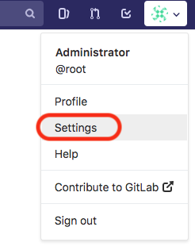
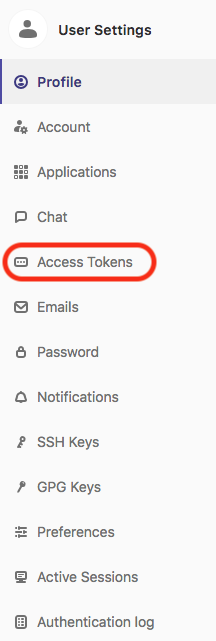
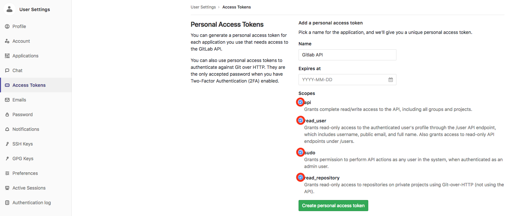

# Installing the labs

These instructions guide you how to let Ansible provision the environment to Amazon AWS. All installation material is in ```content/``` -directory, instructions assume you are working in that directory. Start with cloning this repository, moving into working directory, and adding your ssh key to ssg-agent for ansible to use it:

```
git clone https://github.com/mglantz/ansible-roadshow.git
cd content
ssh-add /path/to/your/amazon-ssh-key-file.pem
```

## Install Ansible

This setup was tested at the time of writing this README with Ansible version 2.6. Follow [Ansible install guidance](https://docs.ansible.com/ansible/latest/installation_guide/intro_installation.html) for your favourite OS, Linux :) .

## Prepare the Ansible dynamic inventory credentials

Before running the installer, you need to install Boto on your Ansible machine using [the Ansible AWS documentation](http://docs.ansible.com/ansible/latest/scenario_guides/guide_aws.html).

## Set AWS parameters for Ansible playbooks

Playbooks expect file ```content/vars/vars.yml``` for setting your personal AWS credentials, machine AMI image and some other parameters. Copy ```content/vars/vars-example.yml``` and fill it with your settings. You are recommended to use Ansible vault to encrypt your credentials.

## Encrypting credentials with Ansible Vault

Put whatever password into some file, in this example ```content/vault-password.txt```. Then you can use command ```ansible-vault --vault-password-file content/vault-password.txt encrypt_string``` to encrypt your credentials. The output can be used in the ```content/vars/vars.yml``` file, see example.

You can also just put the credentials in plain text, but make sure you won't commit them into any git! Files ```content/vars/vars.yml``` and ```content/vault-password.txt``` are ignored by git in this repo for safety.

## Install required roles

There are some dependencies for external roles in this setup. You can use Ansible galaxy to install them:

```
ansible-galaxy install -p roles -r roles/requirements.yml
```

## Run Ansible to provision the lab environment

There is playbook ```provision-all.yml``` which includes some other playbooks to create all necessary resources into AWS, and configure each of them. It will use dynamic inventory provided by ```content/inventory/ec2.py```. That's why you need boto setup in addition to credentials in ```content/vars/vars.yml```.

```
ansible-playbook --vault-password-file vault-password.txt -i inventory/ec2.py provision-all.yml
```

_if you don't use vault, ignore ```vault-password-file``` parameter_

## Create Gitlab access token

Once the environment has been provisioned and if you don't feel like using GitHub, you can use Gitlab that was installed with the lab environment.
__Due to limitations in the Gitlab API, you have to create access key for the root user, that was created during the installation by hand.__ This has to be done in order to get the ansible-roadshow -project and student users set up to Gitlab.

Gitlab's default administrator account details are below; be sure to login immediately after installation and change these credentials!

    root
    5iveL!fe

Gitlab will automatically prompt you to change the password.
Password should be set to ```redhat123```, or if you end up choosing something different you will have to modify gitlab-setup.yml to comply with your password.

Once you are logged in, it's time to create the access token for the Administrator user(root).

From the top-right corner click on the avatar and choose settings:



At the settings -page go to menu called "Access Tokens" that is at the left side of the screen:



From that menu you can create Access Token(s) to access the API.
You can name the Access Token how ever you like, but make sure to tick all the boxes under the Scope -section:



Once you click on the "Create personal access token" -button, Access Token will be generated for you, be sure to copy it to your clipboard:


Once you have the access token on your clipboard, copy it to gitlab_token -variable in vars.yml -file and run the gitlab-setup.yml -playbook:

    ansible-playbook gitlab-setup.yml

This will copy the content of the workshop from GitHub to your Gitlab server and create as many user accounts as you have Ansible tower systems.
Users will be named ```student1``` to ```studentX``` and password for the student accounts will be ```redhat123```.

## Delete all resources after doing labs

__Beware this might leave something out, do check yourself from AWS__

There is a helper playbook, which deletes all resources created for this lab from AWS. But you never know if someone adds something to labs, and forgets to also add it into ```delete_instances.yml``` playbook. If you develop this further, do always remember to include your added resources into ```delete_instances.yml```.

After labs are done, stop billing by running:

```
ansible-playbook --vault-password-file vault-password.txt -i inventory/ec2.py delete_instances.yml
```

_if you don't use vault, ignore ```vault-password-file``` parameter_

# HAPPY LABS!

Systems should be up in 15 minutes. Happy learning!

# ToD0

At the time of writing, not all playbooks are included in do_all.yml. Remove this line once the issue is taken care of.
