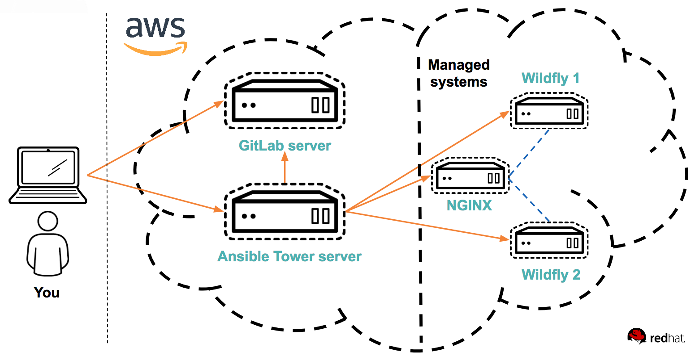

# Preparations

1. To get started with the labs, you first needs to get your assigned username and servers. This will be provided to you by the people who operates this lab.

2. Required tools to do the lab is
* An SSH client. On Linux and Mac, use the native ssh client in a terminal. On Windows, you can use PuTTy: https://www.chiark.greenend.org.uk/~sgtatham/putty/latest.html)
* A web browser with internet access

3. Please review the overview of the lab environment. Most importantly, the Ansible Tower server is from where all the labs are done.
```
PLEASE NOTE
DO NOT execute any of the labs from your local laptop.
```



The Ansible Tower server will have the responsibility of provisioning the managed systems in later labs. For now, you will spend time in the Ansible Tower server.

4. Once in the system, you have to use one of the text based text editors available. If you are new to Linux, see below for a simple guide for the different available text editors. Use them as reference when needed. For now, go ahead and proceed in the lab.

* **nano**: https://wiki.gentoo.org/wiki/Nano/Basics_Guide
* **vi/vim**: https://vim.rtorr.com/ 

5. Log in as the **student** user on your assigned Ansible Tower server.
6. Run below command to pull the code to your system:
```
cd
git clone https://github.com/mglantz/ansible-roadshow.git
```
7. The variabel **$LAB_DIR** will refer to the root of the cloned repository, export it as an variable using below command:
```
export LAB_DIR=/home/student/ansible-roadshow
```

In the **student** user's home directory create an empty dir named **work**, where you will do your assignments. This dir will be referred to as **$WORK_DIR**, export $WORK_DIR as a variable in your shell. To do this, run:
```
cd
mkdir work
export WORK_DIR=/home/student/work
```

Keep in mind that if you get logged out from a system, you need to set the **WORK_DIR** and **LAB_DIR** variables again by running the _export_ command as shown above.

```
End of lab
```
[Go to the next lab, lab 1](../lab-1/README.md)
