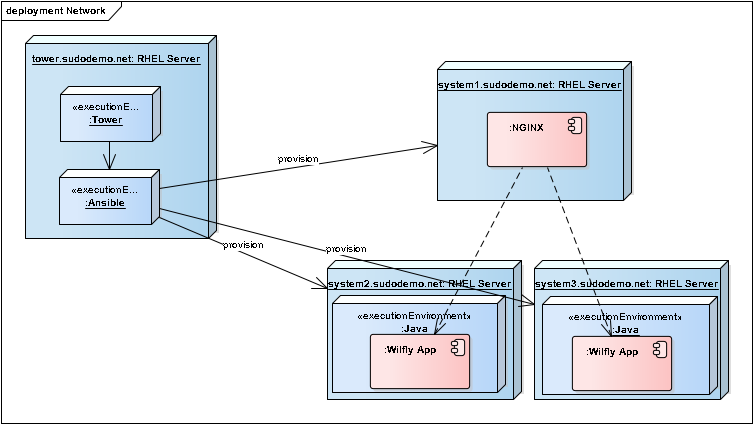

# Preparations

1. To get started with the labs, you first needs to get your assigned username and servers. This will be provided to you by the people who operates this lab.

2. Required tools to do the lab is
* An SSH client. On Linux and Mac, use the native ssh client in a terminal. On Windows, you can use PuTTy: https://www.chiark.greenend.org.uk/~sgtatham/putty/latest.html)
* A web browser with internet access

2. Please review the overview of the lab environment. Most importantly, the Ansible control servers is from where all the labs are done.
```
PLEASE NOTE
DO NOT execute the labs from your local laptop.
```



* _Please note that the Ansible control server is from where all labs are executed._

The Tower server will have the responsibility of provisioning the servers, which are implementing a simple http based service.

The NGINX server is responsible for balancing the load between the two backend servers. The backends are implemented using wildfly swarm, run as a simple java application.

1. Log-on to the Ansible Tower / Control server.
2. Navigate to a location of your choice.
3. Use the command *git clone https://github.com/mglantz/ansible-roadshow.git* to pull the code to the server.
4. $LAB_DIR will refer to the root of the cloned repository*.

Create an empty dir, where you will do your assignments. This dir will be refered to as $WORK_DIR, suggestion is that you export $WORK_DIR as a variable in your shell. So, for example:
```
$ mkdir /home/student/work
$ WORK_DIR=/home/student/work
```

```
End of lab
```
[Go to the next lab, lab 1](../lab-1/README.md)
