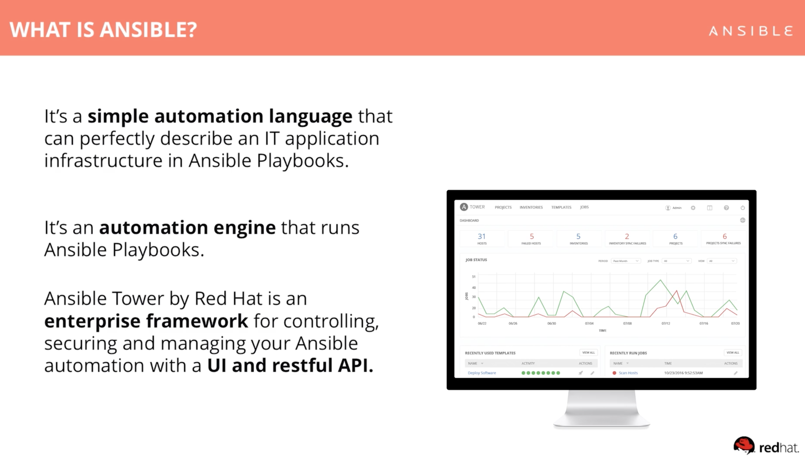
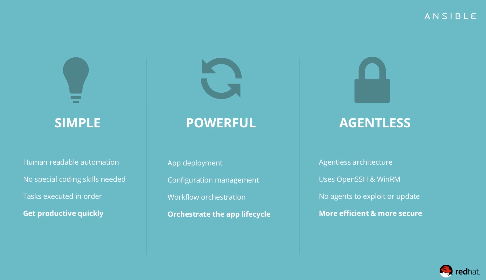
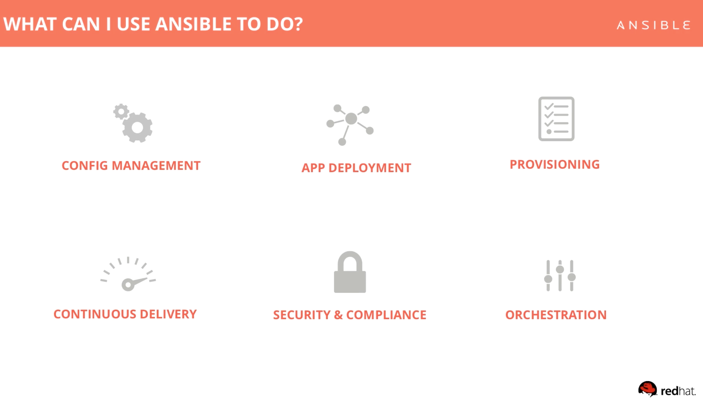

# Getting started

:boom: What is Ansible? Check out this short description.


Ansible is an powerful automation and orchestration engine, powerful enough to automate everything from IoT lightbulbs to cloud infrastructure - yet, simple enough for everyone to use. Even those who are not a programmer.


The reason why Ansible has become so pupular is because it's simple. No coding skills are required. Even a lot of non technical staff in your organization can read and understand Ansible playbooks. This simplicity means that you get started in minutes. Ansible is clientless, using SSH, Win RM or application specific APIs. Ansible also works as you think, tasks are executed in order, top to bottom - much adding to the simplicity. While simple, it's power enough to model the most complex workflows in IT.


Ansibles catch phrase is "automate all things" and this reflects fairly on what it can do. People use Ansible to automate all things. This differentiates it from the other automation frameworks or systems, which only automates parts of your IT landscape - adding fragmentation and lock-in while making collaboration more difficult.

:exclamation: _Ensure that you are logged in to your Ansible Tower server as the **student** user._

You are the operator at Tangible Labs Inc. and tasked with setting up servers for the company's new application that's based on WildFly Swarm, which is a modern and tiny application server. After attending several sessions on automation, you've decided to give Ansible a go.

The first lab will help you verifying the Ansible installation and getting acquainted with basic Ansible concepts.

Please note that by installing Ansible on your control server in advance, we have not robbed you of any valuable experience. Installing Ansible is a _very_ simple thing to do. For later reference when you get home, you can look at this guide for installing Ansible on a host of different operating systems: https://docs.ansible.com/ansible/latest/installation_guide/intro_installation.html

:boom: With this said, let's verify that Ansible has been installed. On the command-line interface run the following command:

```
ansible --version
```

You should see output similar to this:

```
$ ansible --version
ansible 2.6.3
  config file = /etc/ansible/ansible.cfg
  configured module search path = [u'/home/student/.ansible/plugins/modules', u'/usr/share/ansible/plugins/modules']
  ansible python module location = /usr/lib/python2.7/site-packages/ansible
  executable location = /usr/bin/ansible
  python version = 2.7.5 (default, May 31 2018, 09:41:32) [GCC 4.8.5 20150623 (Red Hat 4.8.5-28)]
```

 :boom: As you can see Ansible uses Python. Inspect the config file (/etc/ansible/ansible.cfg) file by running:
```
more /etc/ansible/ansible.cfg
```
You will find the following configuration _in the top of the config file_:

```
# config file for ansible -- https://ansible.com/
# ===============================================

# ...
[defaults]

# ...

#inventory      = /etc/ansible/hosts
#library        = /usr/share/my_modules/
#module_utils   = /usr/share/my_module_utils/
```

 :thumbsup: Most important to note is the default location of the inventory file. The inventory file is used to define servers that you are managing. If you do not define the location of the inventory when running a playbook, ansible will look in the default inventory file. Inside of the inventory, managed systems can be grouped in any way you like. Best practices for grouping service in an inventory is to ask three simple questions, _WHAT_, _WHERE_, _WHEN_ and then fill in the blanks. An example inventory file can look like. This way, we can refer to the same servers in different ways depending on the perspective (WHAT, WHERE or WHEN):

```
# WHAT                WHERE               WHEN
[db]                  [east]              [dev]
db[1:4]               db1                 db1
                      db3                 web1
[web]                 web1
web[1:3]              web3                [test]
                                          web2
                      [west]              db2
                      db2
                      db4                 [prod]
                      web2                web[3:4]
                      web4                db[3:4]
```

For this lab, we will start and group the servers into _WHAT_ - load balancers (lbservers) and WildFly Swarm application servers (wildflyservers).

 :thumbsup: Another inventory best practice is that if you happen to have systems which are named 'srv1234-e445.gdml.oo.sld.foo' or as meaningless, you may want to think about giving your systems human meaningful aliases in your inventory, such as web1 or similar. The reason for this is _readability_. Both your playbooks and your playbooks' output will become more readable. We will soon implement some human meaningful aliases for the systems in this lab.

 :exclamation: Before we continue, make sure that the $WORK_DIR variable is defined. If $WORK_DIR is not defined, [take a look at the preparations.](https://github.com/mglantz/ansible-roadshow/tree/master/labs/lab-0)\

:boom: Now, create a file named *hosts* in the *$WORK_DIR* folder.

```
cd $WORK_DIR
touch hosts
```
:exclamation: You got three servers assigned to you, referred to as **'Managed Systems'** when given to you. It doesn't matter which one is put in the [lbservers] section and which remaining two are put in the [wildflyservers] section.

:boom: Add the following text to the _$WORK_DIR/hosts_ file using an editor of choice:
```
[lbservers]
loadbalancer1 ansible_host=xxx.xxx.xxx.xxx

[wildflyservers]
wildfly1 ansible_host=yyy.yyy.yyy.yyy
wildfly2 ansible_host=zzz.zzz.zzz.zzz
```
Where x, y and z values are replaced by the ip numbers for **Managed Systems** IP addresses assigned to you.

:boom: **Optionally**, create the content in a text editor on your laptop and paste below (with your IP-addresses) text into a terminal:
```
cat << 'EOF' >$WORK_DIR/hosts
[lbservers]
loadbalancer1 ansible_host=xxx.xxx.xxx.xxx

[wildflyservers]
wildfly1 ansible_host=yyy.yyy.yyy.yyy
wildfly2 ansible_host=zzz.zzz.zzz.zzz
EOF
```

:exclamation: Take some extra time, verifying that there are three different IP addresses in your file, when you are done.\
Your $WORK_DIR/hosts file should look like something like below now:
```
[lbservers]
loadbalancer1 ansible_host=18.184.68.153

[wildflyservers]
wildfly1 ansible_host=35.157.198.225
wildfly2 ansible_host=18.184.165.148
```

:boom: Since this is the first time we're connecting to these servers, you'll need to accept the identity of the servers.
To speed up the process, we use the ssh-keyscan command to accept identities. Run below command:

```
ssh-keyscan -H xxx.xxx.xxx.xxx yyy.yyy.yyy.yyy zzz.zzz.zzz.zzz >> ~/.ssh/known_hosts
```

:boom: You are now ready to run your first Ansible module. To do so, run the following command from *$WORK_DIR*

```
cd $WORK_DIR
ansible -i hosts all -m ping
```

This command will run the ping command on all servers in the hosts file (specified by -i).\

:exclamation: **If the previous step failed, you might be asked to accept the identity of the servers.**
Then: type yes for each server. After running the ping command, you'll have following output

```
wildfly1 | SUCCESS => {
    "changed": false, 
    "ping": "pong"
}
wildfly2 | SUCCESS => {
    "changed": false, 
    "ping": "pong"
}
loadbalancer1 | SUCCESS => {
    "changed": false, 
    "ping": "pong"
}
```

Congratulations! :smile: :tada: You've run your first Ansible command.

:boom: For a more detailed explanation of what is going on, try running the same command but add the *-vvv* parameter

```
cd $WORK_DIR
ansible -vvv -i hosts all -m ping
```

 :star: What happens here is that the command will ssh to each host and run the ping module on the host. The result is captured by Ansible in a return variable. (If you are interested in the content of a module, see the source code for the ping module [in the github repo for modules](https://github.com/ansible/ansible-modules-core/blob/devel/system/ping.py). You don't have to. Modules will be covered in a later lab.)

In the next lab, you'll write your first playbook using the ping module to get a better understanding of how Ansible works.

```
End of lab
```
[Go to the next lab, lab 2](../lab-2/README.md)
