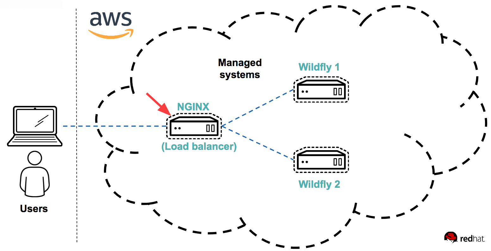
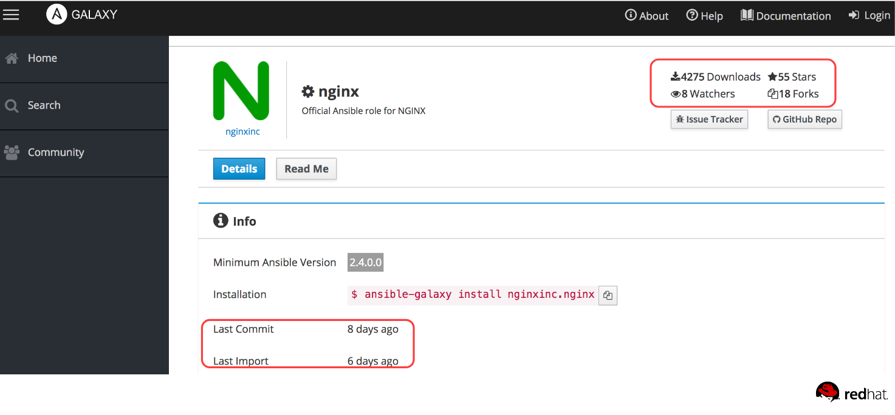

# Writing the load balancer playbook

In the previous lab, we created two WildFly Swarm servers running our application. The next step is to setup a loadbalancer. We will use Nginx as the loadbalancer in this lab. Let's overview which part of the system which you will be working on.



A role has already been written for installing Nginx with Ansible. The role can be found at the Ansible Galaxy site (https://galaxy.ansible.com/nginxinc/nginx/). [Ansible Galaxy](https://galaxy.ansible.com) is the place where roles and modules are shared. 

 :thumbsup: As always be critical when using content on the internet. When it comes to roles on Ansible Galaxy it's easy to do a quick review of the general health of the role. 



 :thumbsup: Look at development activity of the role and number of downloads. Ansible Galaxy makes this evaulation easy by putting it on the front page of each role, as marked above. If there is not a lot of activity, there may be a risk that the role is not maintained.

:boom: Now that we've seen that the nginx role seems solid. We need to install the role. Run:

```
ansible-galaxy install --roles-path=$WORK_DIR/roles nginxinc.nginx
```

and wait for the role to be installed. When that is done, we can use the role in our playbooks.

:boom: To create a playbook which installs Nginx go to $WORK_DIR and create a new file named *lb.yml* with the following content:

```
---
- name: Install NGNIX
  hosts: lbservers
  become: true
  tasks:
  - include_role:
      name: nginxinc.nginx
```

:boom: Now, run the playbook to install NGINX on your server in the lbservers group, use the command

```
ansible-playbook -i hosts lb.yml
```
You can again run the playbook multiple times, to ensure that this role is idempotent and that nothing changes the second or third time you run it.

This installs _nginx_ on the servers in the lbservers group. 

:boom: To verify the installation, in your web browser, go to: *http://$loadbalancer1-ip-address*.

You should get the Nginx default page, as shown above. Take some extra time to appreciate how very simple it was to install the NGNIX software, even though you may never have done that before.

Next step is to configure Nginx as a loadbalancer for the two wildflyapp servers. To do so, we'll add an additional role for the configuration. We follow the [best practises for Ansible directory layout](http://docs.ansible.com/ansible/latest/user_guide/playbooks_best_practices.html) and place tasks, handlers, and vars in separate directories. This is done so that it's easier to collaborate and maintain your work. 

:boom: To create a boilerplate for our new role, which features these best practices, we use the ansible-galax command. Run below commands:

```
cd $WORK_DIR
ansible-galaxy init roles/nginx-config
```

:boom: First we'll create a handler for restarting the Nginx service in case of configuration changes. Define the handler in the file *$WORK_DIR/roles/nginx-config/handlers/main.yml* by replacing the content in the file with:

```
---
- name: restart-nginx-service
  systemd:
    state: restarted
    daemon_reload: yes
    name: nginx
```

:boom: This defines a handler named *restart-nginx-service*, which we'll use in a moment. Now replace the content in the file *$WORK_DIR/roles/nginx-config/tasks/main.yml* with below:

```
---
- name: Configure ngnix to listen for http
  template:
    src: default.template
    dest: /etc/nginx/conf.d/default.conf
  notify: restart-nginx-service
- name: Ensure nginx is started and persisted across reboot
  systemd:
    name: nginx
    enabled: yes
    masked: no
    state: started
- name: Set and persist httpd_can_network_connect SELinux flag for ngnix
  seboolean:
    name: httpd_can_network_connect
    state: yes
    persistent: yes
```
A template is used to setup the ngnix http listener. The template ensures that your configuration file doesn't have to be static. In this case, you need to add the servers to loadbalance between. This is done by introducing a variable *wildfy_servers*, which you'll use when writing the template shortly. The configuration file is saved instead of the default.conf nginx template. Other approaches applies. Please refer to the nginx documentation for more information. If the configuration file is changed, the previously defined handler (*notify: restart-nginx-service*) ensures that the Nginx process is restarted. Finally a SELinux rule has to be setup, to allow Nginx to connect to port 8080.

:boom:  Define the variable *wildfly_servers* by replacing *$WORK_DIR/roles/nginx-config/vars/main.yml* with below content:

```
---
wildfly_servers: "{{ groups['wildflyservers'] }}"
```

:boom: Edit $WORK_DIR/lb.yml to include the newly created role:

```
---
- name: Install and configure NGINX as a load balancer
  hosts: lbservers
  become: true
  tasks:
  - include_role:
      name: nginxinc.nginx
  - include_role:
      name: nginx-config
```

After having extended the playbook to add the loadbalancer configuration, you need to add the template file for the configuration.

:boom: In your favorite editor create the file *$WORK_DIR/roles/nginx-config/templates/default.template* and add the following content:

```
upstream backend {

    server {{ hostvars[host].ansible_host }}:8080;

}
server {
    listen       80;
    server_name  localhost;

    access_log  /var/log/nginx/host.access.log  main;

    location / {
        proxy_pass http://backend;
    }

    # redirect server error pages to the static page /50x.html
    #
    error_page   500 502 503 504  /50x.html;
    location = /50x.html {
        root   /usr/share/nginx/html;
    }
}
```

As you can see, the *wildfly_servers* variable is used to iterate over the servers with the WildFly application deployed.

:boom: Apply the changes to the nginx configuration by running the playbook:

```
cd $WORK_DIR
ansible-playbook -i hosts lb.yml
```

The playbook should complete as such:
```
PLAY RECAP *****************************************************************
loadbalancer1              : ok=8    changed=3    unreachable=0    failed=0 
```

:boom: Now test, that you can access the application on both application servers. For this we'll use a simple http client, called _curl_, in your terminal write:

```
curl -w '\n' http://IP-address-of-loadbalancer1/
```

When running the command multiple times, you should see different wildfly servers responding, as shown below:

```
$ curl -w '\n' http://18.184.24.113/
Howdy from unknown at 2018-08-31T08:07:32.948Z (from ip-172-31-25-165.eu-central-1.compute.internal)
$ curl -w '\n' http://18.184.24.113/
Howdy from unknown at 2018-08-31T08:07:48.816Z (from ip-172-31-28-91.eu-central-1.compute.internal)
$
```

:boom: Finally create a playbook to collect the two playbooks already made, by creating a file named *main.yml* in *$WORK_DIR* with the following content:

```
---
- import_playbook: lb.yml
- import_playbook: site.yml
```

:boom: By running this playbook, you can setup everything with one command. Try it out.

```
ansible-playbook -i hosts main.yml
```

The playbook should complete as such:
```
PLAY RECAP ****************************************************************
loadbalancer1              : ok=7    changed=0    unreachable=0    failed=0   
wildfly1                   : ok=8    changed=0    unreachable=0    failed=0   
wildfly2                   : ok=8    changed=0    unreachable=0    failed=0 
```

```
End of lab
```
[Go to the next lab, lab 5](../lab-5/README.md)
