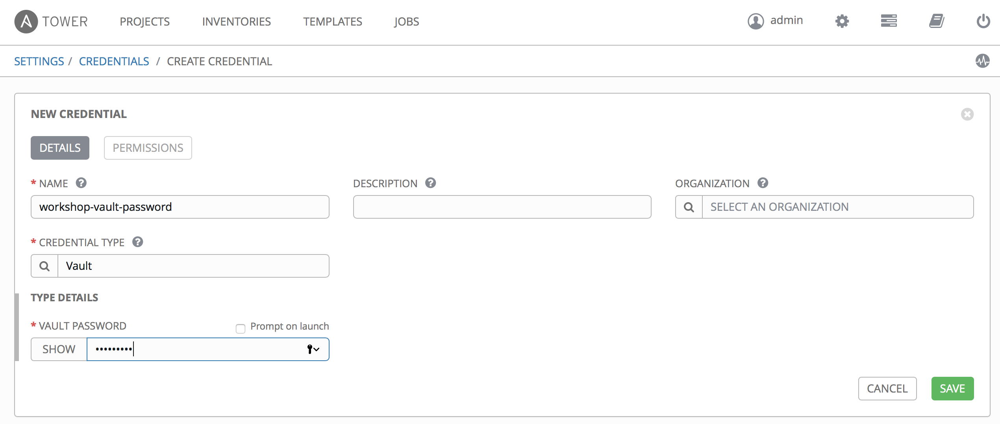
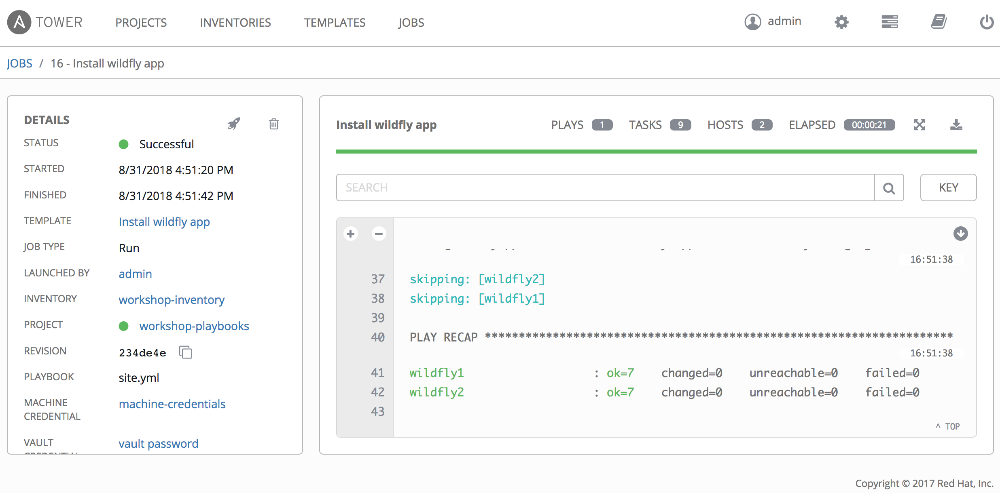
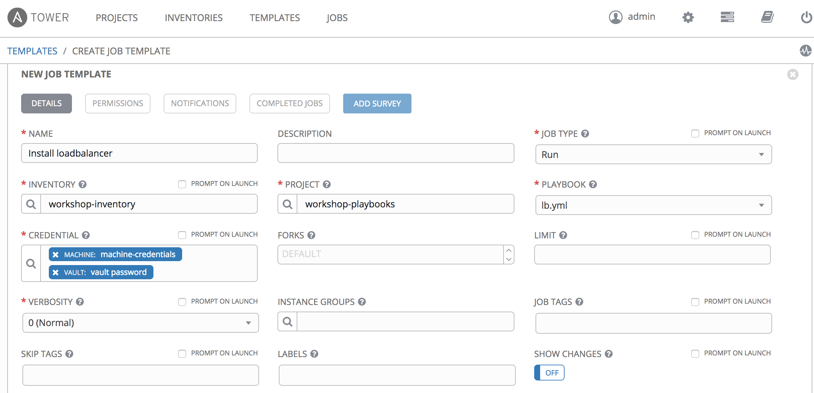

# Installing WildFly and Nginx from Tower

As the good developer you are, you now want to make sure your playbooks for provisioning the WildFly app is available for the whole organization to run and benefit from. This requires that you handle your Ansible content as code. This lab will describe how you can do so.

The first step is to transfer your work that you did in $WORK_DIR on a local server, to the central git repository. As the whole company is going to run this, you need to version control your work and you would also like to enable people to contribute to your work, to make it better.

:boom: First, we need to configure the git client with your information. Replace the X in studentX with your assigned number., then run below commands in a terminal:
```
git config --global user.email "studentX@domain.suffix"
git config --global user.name "studentX"
```
:boom: Then we're going to check out the _git repository_ which you created earlier, in **lab 7**, where you again place the X in studentX with your assigned number. Run below commands in a terminal:

```
cd
git clone https://GITLAB-SERVER-DOMAIN-NAME/studentX/studentX-project.git
```

The output should be similair as follows:
```
$ git clone https://ec2-52-57-173-62.eu-central-1.compute.amazonaws.com/student1/student1-project.git
Cloning into 'student1-project'...
remote: Enumerating objects: 7, done.
remote: Counting objects: 100% (7/7), done.
remote: Compressing objects: 100% (5/5), done.
remote: Total 7 (delta 1), reused 0 (delta 0)
Unpacking objects: 100% (7/7), done.
```

This will have created a directory called /home/student/studentX-project where your files in the git repository has been copied. Now we're ready to copy your work in $WORK_DIR into this directory. 

:boom: Do this by running below commands (_replace X in studentX with your assigned number_):
```
export WORK_DIR=/home/student/work
cp -R $WORK_DIR/* /home/student/studentX-project
```

:boom: Next we need to tell git that we've added a bunch of new files.
First we'll create a `.gitignore` file to avoid pushing unwanted files to the git repository.
We don't want to have the `mypassword` file pushed to a public repository!
The `nginxinc.nginx` comes from [Ansible Galaxy](https://galaxy.ansible.com/nginxinc/nginx/) and shouldn't be part of our repository either.
Run below commands to do that (_replace X in studentX with your assigned number_):
```
cd ~/studentX-project
echo "mypassword" >> .gitignore
echo "roles/nginxinc.nginx" >> .gitignore
```

:boom: We can now safely add all the files to git.
```
git add .
```

:boom: Now we can create a commit message for the changes we've made. A commit message is ment to be useful for other people, when scanning a repository for what changes has been made. _Ensure you are in the /home/student/studentX-project directory_ and run:
```
git commit -m 'Moving my local workspace to git'
```

The output should be similair as:
```
$ git commit -m 'Added workshop workspace to git'
[master 726a864] Added workshop workspace to git
 28 files changed, 356 insertions(+)
 create mode 100644 binaries/example-jaxrs-war-swarm.jar
 create mode 100644 group_vars/dev/wildflyservers/vars.yml
 create mode 100644 group_vars/dev/wildflyservers/vault.yml
 create mode 100644 hosts
 create mode 100644 lb.yml
 create mode 100644 main.yml
 create mode 100644 roles/nginx-config/README.md
 create mode 100644 roles/nginx-config/defaults/main.yml
 create mode 100644 roles/nginx-config/handlers/main.yml
 create mode 100644 roles/nginx-config/meta/main.yml
 create mode 100644 roles/nginx-config/tasks/main.yml
 create mode 100644 roles/nginx-config/templates/default.template
 create mode 100644 roles/nginx-config/tests/inventory
 create mode 100644 roles/nginx-config/tests/test.yml
 create mode 100644 roles/nginx-config/vars/main.yml
 create mode 100644 roles/wildflyapp/README.md
 create mode 100644 roles/wildflyapp/defaults/main.yml
 create mode 100644 roles/wildflyapp/handlers/main.yml
 create mode 100644 roles/wildflyapp/meta/main.yml
 create mode 100644 roles/wildflyapp/tasks/main.yml
 create mode 100644 roles/wildflyapp/templates/wildflyapp.template
 create mode 100644 roles/wildflyapp/tests/inventory
 create mode 100644 roles/wildflyapp/tests/test.yml
 create mode 100644 roles/wildflyapp/vars/main.yml
 create mode 100644 site.retry
 create mode 100644 site.yml
 create mode 160000 student1-project
 $
```

:boom: There is now only one last thing to do, that is to upload the files to the central GitLab server. _Ensure you are in the /home/student/studentX-project directory_ and run below command. You will there be queried for the studentX credentials to the GitLab server:
```
git push
git config --global push.default matching
```

Output should be something similair as this:
```
$ git push
warning: push.default is unset; its implicit value is changing in
Git 2.0 from 'matching' to 'simple'. To squelch this message
and maintain the current behavior after the default changes, use:

  git config --global push.default matching

To squelch this message and adopt the new behavior now, use:

  git config --global push.default simple

See 'git help config' and search for 'push.default' for further information.
(the 'simple' mode was introduced in Git 1.7.11. Use the similar mode
'current' instead of 'simple' if you sometimes use older versions of Git)

Username for 'https://ec2-52-57-173-62.eu-central-1.compute.amazonaws.com': student1
Password for 'https://student1@ec2-52-57-173-62.eu-central-1.compute.amazonaws.com': 
Counting objects: 47, done.
Delta compression using up to 2 threads.
Compressing objects: 100% (25/25), done.
Writing objects: 100% (46/46), 54.50 MiB | 94.66 MiB/s, done.
Total 46 (delta 1), reused 0 (delta 0)
To https://ec2-52-57-173-62.eu-central-1.compute.amazonaws.com/student1/student1-project.git
   10ed357..726a864  master -> master
$ git config --global push.default matching
$
```

Congratulations, all your content is now in git. You can review it by looking in the repo in GitLab.

:exclamation: **WARNING. SPECIAL ATTENTION TO BELOW TASK.**
 
:boom: :boom: **Now that you have moved all work to _/home/student/studentX-project_ let's change the WORK_DIR variable. Change the X in studentX to your assigned number and run:**
```
export WORK_DIR=/home/student/studentX-project
```

Now you need to instruct Ansible Tower to use the Nginx module. You could install the module on Ansible Tower as previously, but this would have the unwanted effect that all projects on the Ansible Tower server would rely on this module. Furthermore the Ansible Tower server now needs special care if you need to reinstall it. Instead we'll instruct Ansible Tower to include the Nginx module as part of our project. 

:boom: To do so, add a file *$WORK_DIR/roles/requirements.yml*, with the following content
```
---
- src: https://github.com/nginxinc/ansible-role-nginx
  version: master
  name: nginxinc.nginx
```

:boom: Check in the change and you are ready to go. Do that by running below in a terminal:
```
cd $WORK_DIR/roles
git add requirements.yml
git commit -m 'Requirements file for roles'
git push
```

The output should be similair as this:
```
$ cd $WORK_DIR/roles
$ git add requirements.yml
$ git commit -m 'Requirements file for roles'
[master 234de4e] Requirements file for roles
 1 file changed, 4 insertions(+)
 create mode 100644 roles/requirements.yml
$ git push
Username for 'https://ec2-52-57-173-62.eu-central-1.compute.amazonaws.com': student1
Password for 'https://student1@ec2-52-57-173-62.eu-central-1.compute.amazonaws.com': 
Counting objects: 6, done.
Delta compression using up to 2 threads.
Compressing objects: 100% (4/4), done.
Writing objects: 100% (4/4), 476 bytes | 0 bytes/s, done.
Total 4 (delta 1), reused 0 (delta 0)
To https://ec2-52-57-173-62.eu-central-1.compute.amazonaws.com/student1/student1-project.git
   a8a991b..234de4e  master -> master
$
```

:boom: Now, login to the Ansible Tower server using your web browser on with the url and username/password provided to you by the instructors.

:exclamation: If you are still logged in as your unpriviledged workshop-guest user, you will not see anything ;) Login back as with the credentials provided to you by the instructors.

:boom: You created a project in Ansible Tower in **lab 7**. Let's go to the Project tab and issue a sync of that project, as there is quite a lot of new stuff there now (all playbooks and roles you added from /home/student/work).


:boom: Ensure that the sync updates the _REVISION_ number. 

:boom: Now it's time to modify the Inventory you created in **lab 7** so that it also has the same groups you have in your 'hosts' inventory file. To do so go to "INVENTORIES" -> "workshop-inventory" -> GROUPS". Here click "+ADD GROUP".


:boom: Create three groups named:
* dev
* wildflyservers
* lbservers

:boom: Click "SAVE" for each group.

:boom: Next add the hosts to the correct groups. For each group click on the group name and then on the "HOSTS" tab. For instance clicking "dev" -> "HOSTS" will bring you to the following screen, where you can add hosts to the group


:boom: Add all hosts to the dev group.\
:boom: Add loadbalancer1 to the lbservers group\
:boom: Add wilfly1 and wildfly2 to the wildflyservers group\

Using above described method.

:boom: Next you need to setup the vault password for your playbooks. To do so click the *settings* menu item in top of the menu


:boom: On the items, which appear click *credentials*. Then click *ADD*. Select Vault as credential type and the fill in values as provided in below screenshot (the password should be what you selected earlier and saved in _/home/student/work/mypassword_).

Click *SAVE* and you're done with this part.

Phew that's a lot of work. Luckily there is other ways of doing this, but the GUI is the easiest way to help you understand what's going on. Maybe grab a cup of :coffee: at this point - almost there.

:boom: The template is where it all comes together. So now click the *TEMPLATES* menu item and click *ADD* and select *Job Template*. Fill in values as below

 :exclamation: Be aware that to select the credentials you must use the search button and select credential type as appropriate.


:boom: Now you should be able to launch your playbooks. Click the *TEMPLATES* menu item. Then click the rocket to the right of the 'Install WildFly App' template.


Expect a simlair output as below:


Isn't that beautiful? You are now in control of who runs what Ansible automation, on what systems. Everything is logged and kept safe. It's no longer just an Ansible playbook and a role, it's _automation as a service_, available via GUI, CLI and RestAPI.

:boom: Now, we'll do the same for installing the _loadbalancer_. Everything should be the same, except for the playbook, which should be lb.yml, as shown below:



:boom: Try running it as well, when you're done.

:boom: Last step is to create a workflow to pull it all together. To do this, you can create a Workflow Template. So click on the *TEMPLATES* menu item and select *ADD - Workflow Template*. Name the template 'Install full application stack' and click *SAVE*. Now the *WORKFLOW EDITOR* button is active. Click on the button. This will take you to the following screen


:boom: Now click the *START* button, you get to invoke a template. On the right side of the screen, you can select the 'Install WildFly App' template and click *SELECT*. This will add the template to the workflow. When you move the cursor over the added template, a plus sign appears to the right on the box. Click it and a new template is added. Using the same method choose 'Install load balancer' as the template. This template should only run if the previous succeeded. Then click again at the 'Install WildFly' template and select the 'Ping playbook' and select to run that on failure. At this time your workflow should look like this:


:boom: Now you can run the workflow template as any other template. Nifty right? Try it out!

:boom: The changes made in lab 8 will break the ping template. This is because the addition of groups to the inventory also adds some secrets. Add the vault password to the ping template as you did with the other templates made. 

 :star: You can also schedule _job templates_ to run at a later date. If you have spare time, try playing around with that and others features.

Imagine that you had playbooks which patched servers and applications, for example.
Or a playbook which triggered a backup.

```
End of lab
```
[Go to the next lab, lab 9](../lab-9/README.md)
