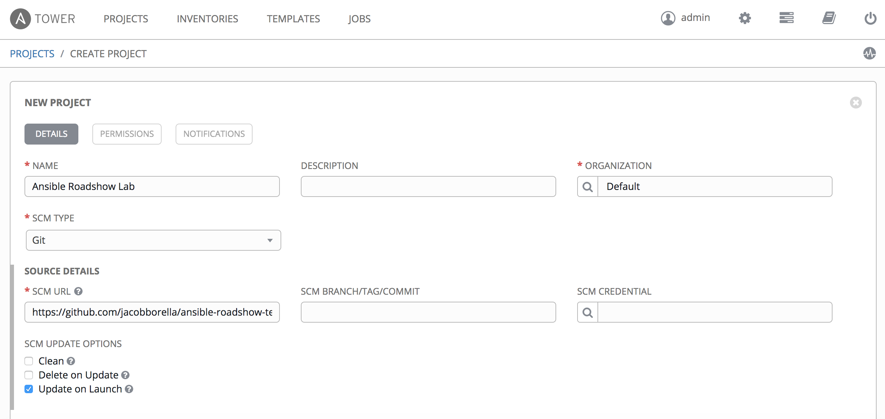
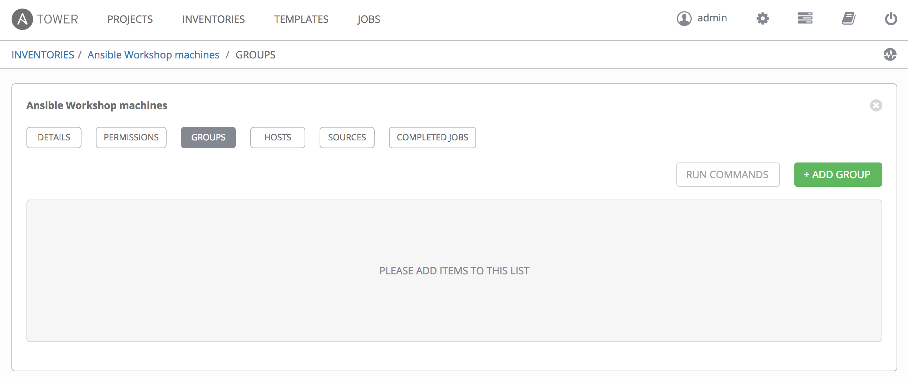
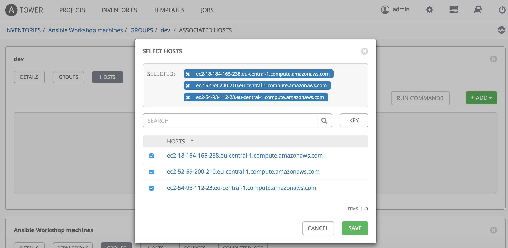
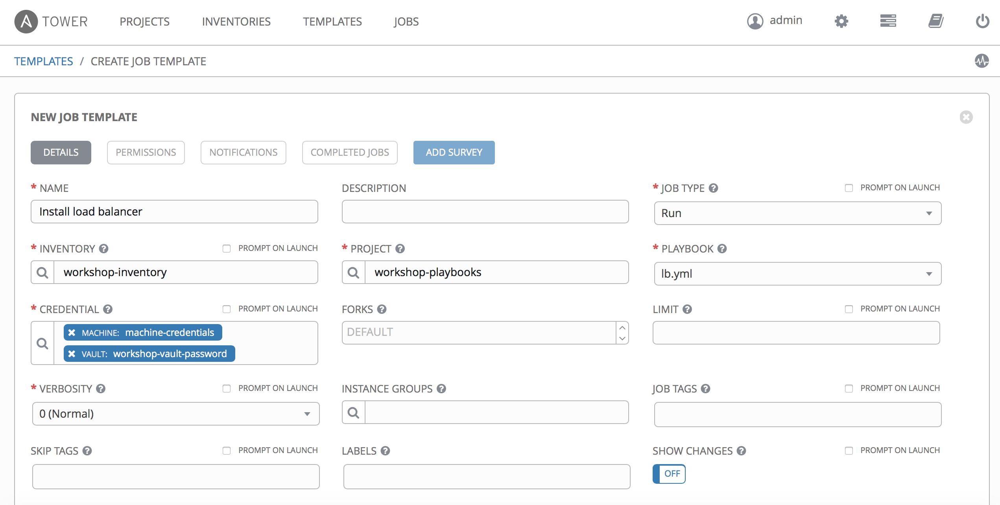
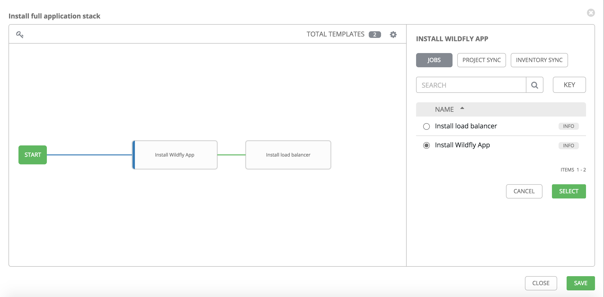

# Installing wildfly and nginx from Tower

As the good developer you are, you want to make your playbooks available for the whole organization to run and benefit from. This labs will describe how you can do so.

First create a new git repo with $WORK_DIR as root directory. If you don't want to spend time on that right now, you can use the one [provided by your instructor](https://github.com/jacobborella/ansible-roadshow-test).

Login to the Ansible Tower server on the url and username/password provided by the instructor. If you haven't setup the credentials to your system as described in the lab [Introducing Ansible Tower](https://github.com/mglantz/ansible-roadshow/tree/master/labs/lab-7), please do so now:-)

Next you need to setup the vault password for your playbooks. To do so click the *settings* menu item in top of the menu

On the items, which appear click *credentials*. Then click *ADD*. Select Vault as credential type and the fill in values as provided in below screenshot (replace password with whatever you chose).

Click *SAVE* and you're done with this part.

First step is to add your code to Tower in form of a project. In this case we'll add the code in form of the git repo, you created earlier.
First click *PROJECTS* in the top menu. Then click *ADD*. Finally fill in values as provided in below screenshot (replace git url with your repo url)

Finally click *SAVE*

Now your code should be fetched into Tower for use. You can verify this has happened by clicking *PROJECTS* menu item and verify there is a green dot left to your project name.

Next we need to define our inventory. This is the same as using the hosts file, but to have everything under control in Tower, we'll use this mechanism. Click on the *INVENTORIES* menu item, click the green *ADD* button and select *Inventory* from the list. Name the inventory *Ansible Workshop machines* and click *SAVE*. Next select the *GROUPS* tab 

Add three groups
* dev
* lbservers
* wildflyservers

Now select the *HOSTS* tab and add the three hosts, which has been assigned to you by the instructor.

When that's done, we need to associate the hosts with the groups. This is most easily done by clicking 'Ansible Workshop machines' in the breadcrumb near the top of the screen.

then select the *GROUPS* tab. Then click on the dev group and then the *HOSTS* tab. Now click *ADD* and select existing host. This will give you a menu, where you can select the hosts. For dev select all hosts and click *SAVE*.

Repeat the process for lbservers and wildflyservers, but this time only select the appropriate machines as in the *hosts* file.

Phew that's a lot of work. Luckily there is other ways of doing this, but the GUI is the easiest way to help you understand what's going on. Maybe grap a cup of cofee at this point - almost there.

The template is where it all comes together. So now click the *TEMPLATES* menu item and click *ADD* and select *Job Template*. Fill in values as below

be aware that in order to select the credentials, you must use the search button and select credential type as appopriate.

Now you should be able to launch your playbooks. Click the *TEMPLATES* menu item. Then click the rocket to the right of the 'Install Wildfly App' template.

This should succeed succesfully. Do the same for the other template.

Last step is to create a workflow to pull it all together. To do this, you can create a Workflow Template. So click on the *TEMPLATES* menu item and select *ADD - Workflow Template*. Name the template 'Install full application stack' and click *SAVE*. Now the *WORKFLOW EDITOR* button is active. Click on the button. This will take you to the following screen

if you now click the *START* button, you get to invoke a template. On the right side of the screen, you can select the 'Install Wildfly App' template and click *SELECT*. This will add the template to the workflow. When you move the cursor over the added template, a plus sign appears to the right on the box. Click it and a new template is added. Using the same method choose 'Install load balancer' as the template. This template should only run if the previous succeeded. At this time your workflow should look like this

Now you can run the workflow template as any other template. Nifty right?

You can also run templates in parallel and sync projects with the repos. If you have spare time, try playing with the features.
